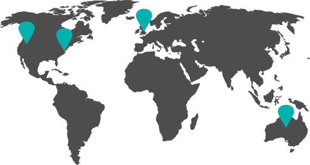

<link rel="stylesheet" href="https://maxst.icons8.com/vue-static/landings/line-awesome/font-awesome-line-awesome/css/all.min.css">

<link rel="stylesheet" href="https://maxst.icons8.com/vue-static/landings/line-awesome/line-awesome/1.3.0/css/line-awesome.min.css">

<link rel="stylesheet" href="https://maxst.icons8.com/vue-static/landings/line-awesome/line-awesome/1.3.0/css/line-awesome.min.css">


```{r, include=FALSE}
library(latex2exp)
library(rmarkdown)
knitr::opts_chunk$set(
  results='asis', 
  echo = FALSE
)
output_dir <- "../docs"

CRANpkg <- function (pkg) {
    cran <- "https://CRAN.R-project.org/package"
    fmt <- "[%s](%s=%s)"
    sprintf(fmt, pkg, cran, pkg)
}

Biocpkg <- function (pkg) {
    sprintf("[%s](http://bioconductor.org/packages/%s)", pkg, pkg)
}

library(glue)
library(tidyverse)

# Set this to true to have links turned into footnotes at the end of the document
PDF_EXPORT <- FALSE

# Holds all the links that were inserted for placement at the end
links <- c()

find_link <- regex("
  \\[   # Grab opening square bracket
  .+?   # Find smallest internal text as possible
  \\]   # Closing square bracket
  \\(   # Opening parenthesis
  .+?   # Link text, again as small as possible
  \\)   # Closing parenthesis
  ",
  comments = TRUE)

sanitize_links <- function(text){
  if(PDF_EXPORT){
    str_extract_all(text, find_link) %>% 
      pluck(1) %>% 
      walk(function(link_from_text){
        title <- link_from_text %>% str_extract('\\[.+\\]') %>% str_remove_all('\\[|\\]') 
        link <- link_from_text %>% str_extract('\\(.+\\)') %>% str_remove_all('\\(|\\)')
        
        # add link to links array
        links <<- c(links, link)
        
        # Build replacement text
        new_text <- glue('{title}<sup>{length(links)}</sup>')
        
        # Replace text
        text <<- text %>% str_replace(fixed(link_from_text), new_text)
      })
  }
  
  text
}


# Takes a single row of dataframe corresponding to a position
# turns it into markdown, and prints the result to console.
build_position_from_df <- function(pos_df){
  
  missing_start <- pos_df$start == 'N/A'
  content_dash <- "$\\bf\\hbox{-}$"
  dates_same <- pos_df$end == pos_df$start
  if (pos_df$end == 9999) {
    pos_df$end = "present"
  }
  if(any(c(missing_start,dates_same))){
    timeline <- pos_df$end
  } else {
    timeline <- glue('{pos_df$start}', '{content_dash}', ' {pos_df$end}')
  }

  descriptions <- pos_df[str_detect(names(pos_df), 'description')] %>% 
    as.list() %>% 
    map_chr(sanitize_links)
  
  # Make sure we only keep filled in descriptions
  description_bullets <- paste('-', descriptions[descriptions != 'N/A'], collapse = '\n')
  
  if (length(description_bullets) == 1 && description_bullets == "- ") {
    description_bullets <- ""
  }
  glue(
"### {sanitize_links(pos_df$title)}

{pos_df$loc}

{pos_df$institution}

{timeline}

{description_bullets}


"
  ) %>% print()
}

# Takes nested position data and a given section id 
# and prints all the positions in that section to console
print_section <- function(position_data, section_id){
  x <- position_data %>% 
    filter(section == section_id) %>% 
    pull(data) 
  
  prese <- " - "
  xx <- list()

  for (i in seq_along(x)) {    
      y = x[[i]]
      y <- cbind(y, start2 = as.character(y$start))
      y <- cbind(y, end2 = as.character(y$end))

      se <- paste(y$start, "-", y$end, collapse = " ")
      if (prese == se) {
        y$start2 = ""
        y$end2 = ""
      } else {
        prese = se
      }

    xx[[i]] <- select(y, -c(start, end)) %>%
      rename(start=start2, end=end2)
  }
    
  xx %>% 
    purrr::walk(build_position_from_df)
}


fill_nas <- function(column){
  ifelse(is.na(column), 'N/A', column)
}

# Load csv with position info
position_data <- read_csv('positions.csv') %>% 
  mutate_all(fill_nas) %>% 
  arrange(order, desc(end)) %>% 
  mutate(id = 1:n()) %>% 
  nest(data = c(-id, -section))
```

```{r}
# When in export mode the little dots are unaligned, so fix that. 
if(PDF_EXPORT){
  cat("
  <style>
  :root{
    --decorator-outer-offset-left: -6.5px;
  }
  </style>")
}
```

Aside
================================================================================


{width=70%}

```{r}
# When in export mode the little dots are unaligned, so fix that. 
if(PDF_EXPORT){
  cat("View this CV online with links at _guangchuangyu.github.io/cv_")
}
```


Contact {#contact}
--------------------------------------------------------------------------------


- <i class="fa fa-envelope"></i> luebhr@gmail.com
- <i class="fa fa-github"></i>  github.com/hluebbering
- <i class="fa fa-link"></i> hannah-luebbering.com
- <i class="fab fa-linkedin-in"></i> linkedin.com/in/hannah-luebbering


Skills {#skills}
--------------------------------------------------------------------------------


<i class="las la-superscript la-lg"></i> Mathematical Modeling

<i class="las la-chart-line la-lg"></i> Statistical Analysis

<i class="las la-project-diagram la-lg"></i> Research and Technology

<i class="las la-microscope la-lg"></i> Spectroscopy and Nanotechnology

<i class="lab la-connectdevelop la-lg"></i> Data Analytics and Visualizations

<i class="lab la-html5 la-lg"></i> Web Design

<i class="lab la-github la-lg"></i> `GitHub`

<i class="lab la-r-project la-lg"></i> `R`

<i class="lab la-java la-lg"></i> `Java`

<i class="lab la-python la-lg"></i> `Python`

<i class="las la-file-code la-lg"></i> `Matlab`


Certificates {#certificate}
--------------------------------------------------------------------------------


<div class="item-content">
IT Automation with Python
<div class="item-meta text-muted">
Google Professional Certificate | 2020
</div>
</div>

<div class="item-content">
Intro to Machine Learning
<div class="item-meta text-muted">
Kaggle Learn Course | 2020
</div>
</div>


\ 

{width=70%}


Main
================================================================================

Hannah Luebbering {#title}
--------------------------------------------------------------------------------


Data Science graduate student at University of Washington. Motivated to learn, grow, and excel in technology.


Education {data-icon="las la-graduation-cap"}
--------------------------------------------------------------------------------

```{r, results='asis', echo = FALSE}
print_section(position_data, 'education')
```


Experience {data-icon="las la-laptop-code"}
--------------------------------------------------------------------------------

```{r, results='asis', echo = FALSE}
print_section(position_data, 'research_positions')
```


Volunteer Positions {data-icon="las la-globe"}
--------------------------------------------------------------------------------


```{r}
print_section(position_data, 'volunteer_positions')
```


Accomplishments {data-icon="las la-users"}
--------------------------------------------------------------------------------


```{r}
print_section(position_data, 'affliation')
```


```{r}
if(PDF_EXPORT){
  cat("
  
Links {data-icon=link}
--------------------------------------------------------------------------------


")
  
  walk2(links, 1:length(links), function(link, index){
    print(glue('{index}. {link}'))
  })
}
```


